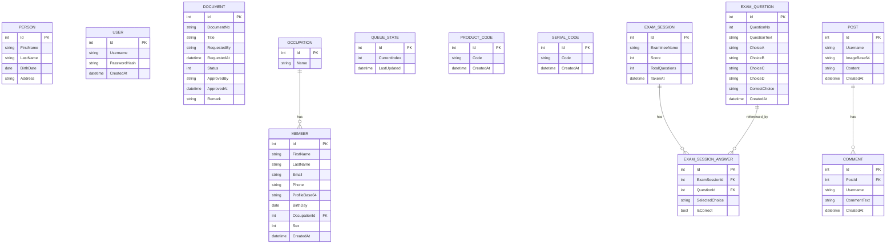

# Test TCC Project

โปรเจกต์นี้แยกเป็น 2 ส่วนหลัก

- `FrontEnd/TestTCCFrontEnd` เป็น Angular 19 สำหรับส่วนหน้าบ้าน
- `BackEnd/TestTCCBackEnd/TestTCCBackEnd` เป็น ASP.NET Core Web API บน .NET 8 สำหรับส่วนหลังบ้าน

Frontend และ Backend เชื่อมกันผ่าน REST API โดยฝั่ง Angular ใช้ base URL `http://localhost:5228/api` และมี `proxy.conf.json` สำหรับตอนพัฒนา

## Er Diagram




## โครงสร้าง Frontend

Frontend ใช้ Angular 19 แบบ standalone components 

### โครงสร้างหลัก

```text
FrontEnd/TestTCCFrontEnd/
├─ src/
│  ├─ app/
│  │  ├─ core/
│  │  │  ├─ guards/
│  │  │  ├─ models/
│  │  │  ├─ repositories/
│  │  │  ├─ services/
│  │  │  └─ use-cases/
│  │  ├─ presentation/
│  │  │  ├─ pages/
│  │  │  └─ shared/
│  │  ├─ app.routes.ts
│  │  └─ app.config.ts
│  ├─ environments/
│  ├─ main.ts
│  ├─ main.server.ts
│  └─ server.ts
├─ angular.json
├─ package.json
└─ proxy.conf.json
```

### Routing ของ Frontend

route หลักอยู่ใน `src/app/app.routes.ts`

- `/` หน้าเมนูหลัก
- `/it01` จัดการข้อมูลบุคคล
- `/it02/login`, `/it02/register`, `/it02/welcome` ระบบสมัครสมาชิกและ login
- `/it03` อนุมัติหรือปฏิเสธเอกสาร
- `/it04` ฟอร์มสมัครสมาชิก
- `/it05`, `/it05/ticket`, `/it05/reset` ระบบคิว
- `/it06` จัดการ product code และแสดง barcode
- `/it07` จัดการ serial code และแสดง QR code
- `/it08` ดูโพสต์และเพิ่มคอมเมนต์
- `/it09`, `/it09/add` จัดการข้อสอบ
- `/it10` ทำข้อสอบและส่งคำตอบ


## โครงสร้าง Backend

Backend เป็น ASP.NET Core Web API บน .NET 8 ใช้ EF Core, SQLite และ JWT Authentication

### โครงสร้างหลัก

```text
BackEnd/TestTCCBackEnd/TestTCCBackEnd/
├─ Controllers/
├─ Data/
├─ DTOs/
├─ Models/
├─ Services/
├─ Properties/
├─ Program.cs
├─ appsettings.json
└─ app.db
```

### การตั้งค่าหลักใน Backend

`Program.cs` ทำหน้าที่สำคัญดังนี้

- ลงทะเบียน `AppDbContext` ให้ใช้ SQLite
- ลงทะเบียน service ผ่าน dependency injection
- เปิดใช้ JWT Bearer authentication
- เปิด CORS แบบ allow all
- เปิด Swagger ใน Development
- เรียก `Database.EnsureCreated()` ตอน startup

### โมเดลข้อมูลหลัก

ใน `AppDbContext` มี `DbSet` สำคัญดังนี้

- `Persons`
- `Users`
- `Documents`
- `Occupations`
- `Members`
- `QueueStates`
- `ProductCodes`
- `SerialCodes`
- `ExamQuestions`
- `Posts`
- `Comments`
- `ExamSessions`
- `ExamSessionAnswers`

ระบบมีการ seed ข้อมูลตั้งต้นบางส่วน เช่น ข้อสอบตัวอย่าง, โพสต์ตัวอย่าง, เอกสารตัวอย่าง, occupation และสถานะคิวเริ่มต้น

## กลุ่ม API หลัก

- `POST /api/Auth/register`
- `POST /api/Auth/login`
- `GET /api/persons`
- `GET /api/persons/{id}`
- `POST /api/persons`
- `GET /api/documents`
- `POST /api/documents/approve`
- `POST /api/documents/reject`
- `POST /api/members`
- `GET /api/members/occupations`
- `GET /api/queue`
- `POST /api/queue/take`
- `POST /api/queue/reset`
- `GET /api/productcodes`
- `POST /api/productcodes`
- `DELETE /api/productcodes/{id}`
- `GET /api/serialcodes`
- `POST /api/serialcodes`
- `DELETE /api/serialcodes/{id}`
- `GET /api/posts/{postId}`
- `POST /api/posts/{postId}/comments`
- `GET /api/examquestions`
- `POST /api/examquestions`
- `DELETE /api/examquestions/{id}`
- `GET /api/exam/questions`
- `POST /api/exam/submit`
## วิธีรันโปรเจกต์

### รัน Backend

```powershell
cd BackEnd\TestTCCBackEnd\TestTCCBackEnd
dotnet run
```

Backend จะรันที่ `http://localhost:5228`

Swagger:

```text
http://localhost:5228/swagger
```

### รัน Frontend

```powershell
cd FrontEnd\TestTCCFrontEnd
npm install
npm start
```

Angular dev server จะใช้ proxy ไปหา backend ตาม `proxy.conf.json`

## เทคโนโลยีที่ใช้

### Frontend

- Angular 19
- Angular Router
- Angular SSR / Hydration
- RxJS
- Bootstrap 5
- `jsbarcode`
- `qrcode`

### Backend

- .NET 8
- ASP.NET Core Web API
- Entity Framework Core
- SQLite
- JWT Bearer Authentication
- BCrypt
- Swagger / OpenAPI
